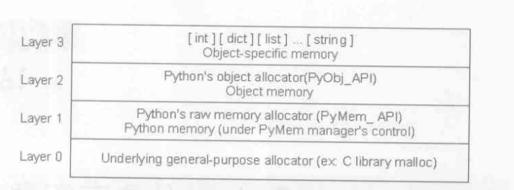
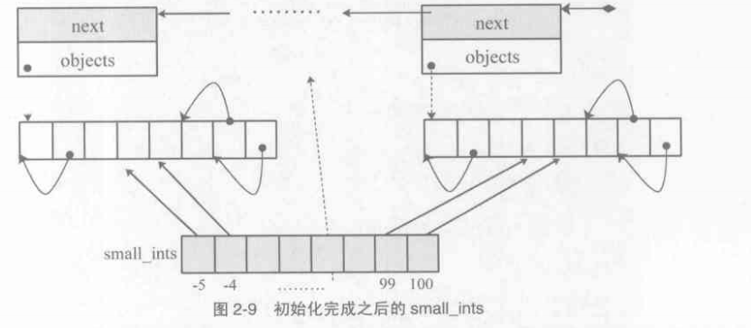
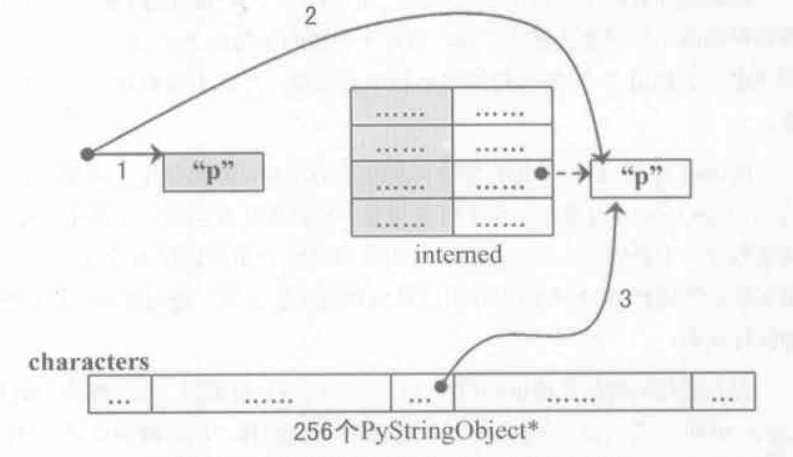

# python 内存管理

- 内存管理机制分三层



0：操作系统接口 malloc

1: 包装了0的 malloc, PyMem_Malloc(n)

2: 内存池

3：常用对象缓冲池

---

## 一、第二层内存池


**分为 arena, pool, block, usedpools**

## block (8 byte align)

1. 一个确定大小的内存块, 大小总是 8 的倍数, 例如申请 28 bytes 时会申请一个 32 bytes 的 block, python 2.5 是的上限是 256 bytes
2. 当 python 申请小于 256 bytes 的时候就会采用这个内存池的方式申请, 大于的时候直接采用上一层的 malloc
3. 没有对应结构, 由 pool 管理

## pool

```c
typedef uchar block;

struct pool_header {
    union { block* padding; uint count;} ref // 已申请的 block 数量
    block* freeblock; // 未分配的 block 的首地址
    struct pool_header *nextpool; // 同一个 size_class 的下一个 pool
    struct pool_header *prevpool; // 同一个 size_class 的上一个 pool
    uint arenaindex;
    uint szidx; // size_class_index
    uint nextoffset; // 第二个 freeblock 相对于 pool 的偏移 
    uint maxnextoffset; // pool 中最后一个 block 的偏移
}
```

1. 一个 pool 大小为 4kb

2. 一个 pool 中所有的 block 大小都是要一样的, 如 32 bytes 和 64 bytes 的两个 block 要分到不同的 pool 管理。使用 size_class_index 记住当前存放的 block 是多大, size_class_index = size >> 3

3. 一个 pool 会出现三种状态
    1. used: 有分配了 block 但是还没满的, 由 usedpools 维护
    2. full: 把所有的 block 都分配满了
    3. empty: 一个 block 都还未分配, 在 freepools 中


4. freeblock 是一条链表, 并不是连续的, 因为当需要释放 block 的时候, 这些空了的 block 如何重用, 答案是用 freeblock 把他们连成一个链表, 一个被释放的 freeblock 指向原来的 freeblock, 即不为 null


5. 因此, pool 分配 block 的流程如下：

    1. 首先判断 *freeblock 是否为 null, 如果是 goto 2, 否则 goto 3
    2. 如果nextoffset <= maxnextoffset, 返回当前 freeblock, 向前推进 freeblock, nextoffset, goto end
    3. 直接返回 freeblock, freeblock = *freeblock

## arena

```c
struct arena_object {
    uptr address;
    block* pool_address;
    uint nfreepools; // 空闲 pool 的数量
    uint ntotalpools; // 总共的 pool 数量
    struct pool_header* freepools; // 空闲 pool 首地址
    struct arena_object* nextarena; // 下一个 arena
    struct arena_object* prevarena; // 上一个 arena
}
```

```c
static struct arena_object* arenas = NULL; // 当前管理的所有 arenas 的数组
static uint maxarenas = 0; 当前管理的 arena_object 个数, 并不是最大个数
static struct arena_object* unused_arena_objects = NULL; // 不可用的 arena 双向链表
static struct arena_object* usable_arenas = NULL; // 可用的 arena 双向链表
```

1. 一个 arena 大小为 256kb, 所以 pool 个数为 256/4 = 64

2. arenas 是一个数组, 所以 pool_header 中的 arenaindex 就是 pool 对应的 arena 数组下标

3. 获取 arena 的过程 (new_arena)

    1. 判断 unused_arena_objects 是否为 NULL, 如果是 goto 2, 否则 goto 3
    2. 从 arenas 中 realloc 申请多个 arena_object 所需要的内存, 然后从 maxarenas 开始, 遍历到申请的最后一个 arena_object, 然后把他们用 nextarena 连起来, 把 address 都设为 0, 再把 unused_arena_objects 的首地址设置为 arenas\[maxarenas\], 最后把 maxarenas 改成当前的 arena_object 个数
    3. 从 unused_arena_objects 中获取第一个 arena_object, 然后 unused_arena_objects = arena_object->nextarena, 申请整个 arena 的内存 256kb, 也就是 arena_object->address, 随后 arena_object-> pool_address = arena_object->address, 还要将 pool_address 对齐到 4kb, 即如果地址是 5kb 那么 pool_address=8kb, 最后返回这个 arena_object

4. WITH_MEMORY_LIMITS 打开时, arena 的总个数会有限制

5. arena 和 pool 不同, 不存在 size class, 所以可以存放不同大小的 pool

## usedpools

1. pool 和 usedpools 中对应的位置关系: 当前可用的 pool 存在于 usedpools\[szidx*2\] 为头的双向链表中

2. 分配内存时是以 pool 为基础而不是 arena, 因为 pool 才有 size class index

## 内存池分配内存的全过程 (PyObject_Malloc)

1. 判断需要申请的内存是否超过 256 byte, 如果超过 goto 2, 否则 goto 3
2. 执行第一层 malloc, goto end
3. 获取内存对应的 size class index, 以下简称 szidx
4. 判断 usedpools\[szidx*2\]->nextpool 是否有可用的 pool, 如果没有 goto 5, 有的话 goto 9
5. 判断 usable_arenas 中是否存在可用 arena,  如果没有 goto 6, 否则 goto 7
6. 执行 new_arena 获取 arena, 然后赋值给 usable_arenas
7. 从获取的 arena 中 arena->freepools 中获取第一个 pool, 如果 freepools 已经用完, 那么 usable_arenas = usable_arenas->nextarena
8. 将获取到的 pool 连接到 usedpools\[szidx*2\] 中
9. 从这个 pool 分配 block 内存, 如果这个 pool 变成了 full 状态, 把这个 pool 从 usedpools\[szidx*2\] 链表中移除

`一句话总结从内存池获取内存顺序: usedpools -> usable_arenas -> freepools`

## block 的释放 (PyObject_Free)

1. pool 状态 used -> used: 从 pool 释放 block 连入 freeblock 中
2. pool 状态 full -> used: 从 pool 释放 block 连入 freeblock 中, 把 pool 连接到 usedpools\[szidx*2\] 中
3. pool 状态 used -> empty: 从 pool 释放 block 连入 freeblock 中, 把 pool 从 usedpools\[szidx*2\] 中移除, 把 pool 放入 arena->freepools 中

- 存在问题: block 内存从不释放
- 解决方案：当 arena 中所有的 pool 都是 empty 的时候将其放回到 unused_arena_objects, 然后释放该 arena 内存, 由于这个方案，arenas 增加了一个机制，就是插入 usable_arenas 的时候，保证前面的 arena 中 empty pool 的数量比后面的少，因为分配 arena 的时候都是从前往后，这样能提高 arena 释放内存的概率

---

## 二、第三层对象缓冲池

1. int



- 小整数会建立一个 small_ints\[NSMALLNEGINTS + NSMALLPOSINTS\] 的静态数组保存 (NSMALLNEGINTS 表示负数下限，NSMALLPOSINTS 表示正数上限)

- 通用整数对象池，这个对象池是一个数组的链表，当一个数组满了之后，会在链表头插入一个新的数组。当整数缓冲被释放的时候，那一块内存会连接在 free_list 的链表中，申请的时候优先到这个 free_list 中去申请，以免出现内存泄漏，这个机制和上面的 freeblock 其实是一个思想

- 其实小整数对象池也是放在通用整数对象池中

2. string



- intern 机制: python 会将合符某个规则的字符串存放到一个统一的 dict 中，当我们 new 一个新的字符串的时候，会先从 intern 的 dict 中检查是否存在相同的 PyString_Object，如果存在则直接引用该对象，否则才引用一个新的对象，注意这里即使使用了 intern 还是会建立一个临时的 PyString_Object 对象用于对比，只是后面会由于引用计数减少而被销毁

- 字符缓冲池: 当我们建立的新字符串只有一个字符的时候，会自动采用 intern 机制，然后再将其放入一个字符缓冲池中，步骤就是图中的1，2，3。然后我们建立相同的字符串对象(只有一个字符)时，会先从字符缓冲池获取。

3. list

- 在 list 对象销毁时，python 首先减少 list 中的所有元素的引用，之后并不会立刻销毁 list，在一定的范围内，存在一个 free_lists 数组保存着这些被销毁的 list 对象，下次创建 list 时会优先从这里获取

4. dict

- 和 list 采用相同的策略