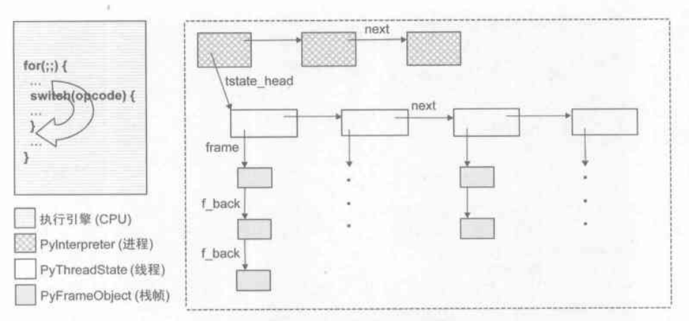
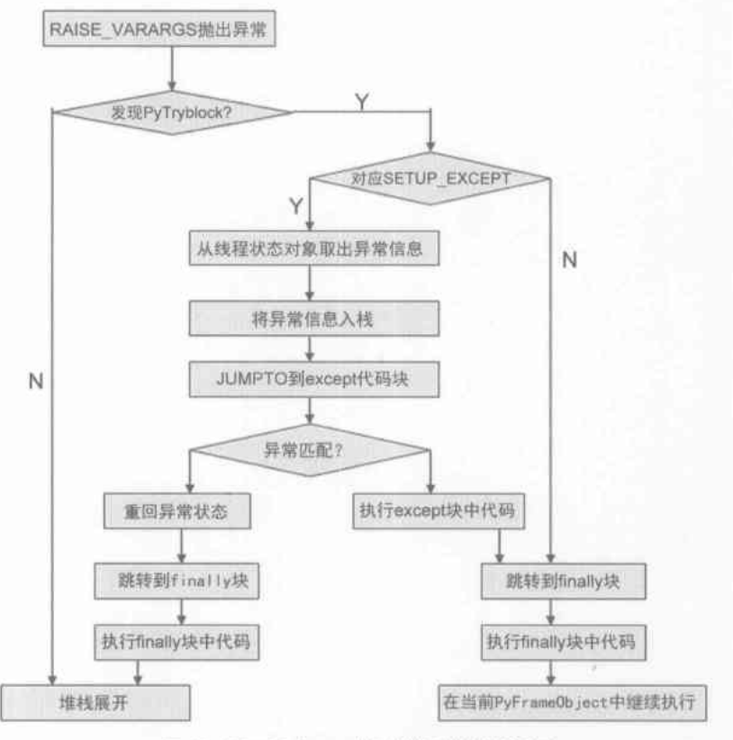

# Python 虚拟机

python 虚拟机的运行依赖于一个运行时栈，栈上会分配栈帧，类似于 x86 的运行时栈，执行的 python 字节码会对栈上的对象进行读写从而实现整个虚拟机的运行

## PyFrameObject

```
typedef struct _frame {
    PyObject_VAR_HEAD
    struct _frame* f_back; // 上一个栈帧
    PyCodeObject* f_code; // PyCodeObject 对象
    PyCodeObject* f_builtins; // built 名字空间
    PyCodeObject* f_globals; // global 名字空间
    PyCodeObject* f_locals; // local 名字空间
    PyCodeObject** f_valuestack; // 运行时栈的栈底位置
    PyCodeObject** f_stacktop; // 运行时栈的栈顶位置
    ...
    int f_last_i; // 上一条字节码在 f_code 的偏移
    int f_lineno; // 当前字节码对应源代码行
    ...
    int f_iblock; // 当前在 f_blockstack 中的索引位置
    PyTryBlock f_blockstack[CO_MAXBLOCKS]; // 异常和循环使用
    ...
    PyObject* local_plus[1];
} PyFrameObject;
```

- 创建 PyFrameObject(PyFrame_New)

    1. 创建 PyFrameObject 头对象
    2. 申请运行需要的内存，如下图
    3. f_valuestack 和 f_stacktop 指向栈顶，因为此时栈中使用大小为0

    
    total_memory = f_code->co_nlocals + size(f_code->co_cellvars) + size(f_code->co_freevars) + f_code->co_stacksize
    extras = f_code->co_nlocals + size(f_code->co_cellvars) + size(f_code->co_freevars)

## 名字空间

1. 赋值语句提供约束，赋值语句不只是只有 a = 1 这种的，是指所有有赋值行为的语句，我自己认为可以理解为创建并定义一个符号的语句，如 def f() 也是一个赋值性质的语句，因为它创建和定义了符号 f，然后它的约束就在 global 空间

2. 最内嵌套作用域原则: 由一个赋值语句引进的名字在这个赋值语句所在的作用域是可见的，而且在其内部的所有作用域也可见，除非它被嵌套作用域中的另一赋值语句覆盖

    1. LGB 原则

    符号查找顺序: local -> global -> builtin

    - builtin 作用域中存放着 python 的内建函数，如 dir, open 等等
    - 三个作用域对应 PyFrameObject 的 f_locals, f_globals, f_builtins
    - 在 py 程序中最外部的 PyFrameObject 中 f_locals == f_globals

    ```
    a = 1
    def f():
        a = 2
        print a // 输出 2
    print a // 输出 1
    ```

    - 函数 f 中有 a=2 赋值因此 f_locals 存在 a, 根据查找顺序得到 local 的 a，第一个输出为 2，而第二个输出已经脱离了 f 的作用域，f_locals 中的 a = 1，因此输出 1
    - 如果把 f 中 `a = 2` 去掉，则第一个输出在 local 作用域找不到 a，根据顺序，就会到 global 里面去找，找到的 a = 1, 因此会输出 1

    2. LEGB 原则

    相比 LGB 增加了 E, 这个 E 是指闭包(enclosing)，意思是直接外围作用域

    ```
    a = 1
    def f():
        a = 2
        def g():
            print a
        return g
    func = f()
    func() // 输出 2
    ```

    - 在 def g() 的时候，python 会将上一行中 a=2 的赋值语句约束绑定到 g 对应的 PyFrameObject 中，这个捆绑后的结果称为闭包，这个过程会在讲函数调用的时候说明

3. 静态作用域规则

```
a = 1
def f():
    print a // UnboundLocalError: local variable 'a' referenced before assignment
    a = 2
```

- 根据上面的规则，这里输出的应该是 1 才对，但是却报了 UnboundLocalError 的错，这是因为 python 的作用域约束并不是在运行时动态绑定的，而是在编译时候的 a=2 对于 f 的 local 作用域已经可见，因此他会在 local 上查找，但是其实赋值语句是下一句，这时候 a 还不是一个有效的引用对象，所以才报错
- 可以通过看字节码来了解，这里 print a 中的字节码是 LOAD_FAST，而如果把 a = 2 去掉的话，字节码是 LOAD_GLOBAL，并没有判断条件，因此可以得出这个作用域是在编译出字节码的时候就已经决定了的
- 解决方法就是在 print a 上一行加入一句 global a, 这样 python 就会认为 a 是引用 global 作用域的了
- 在 python 运行后会把静态的作用域存放到 dict 对象中

4. module 划分名字空间: 不同 module 的名字空间是独立的

5. 属性引用: 如 a.b，这种引用不遵循 LEGB 原则，访问属性有就有，没有就没有

6. 参数传递会创建约束，这个函数调用时讲

## python 运行时环境

```
PyObject *PyEval_EvalFrameEx(PyFrameObject *f, int throwflag) {
    ....
    PyThreadState *tstate = PyThreadState_GET(); // 获取当前线程
    tstate->frame = f;
    co = f->f_code;
    ....
    first_instr = (unsigned char*)PyString_AS_STRING(co->co_code); // 第一条字节码
    next_instr = first_instr + f->f_last_i + 1; // 下一跳字节码
    ....
    why = WHY_NOT; // 退出 for 循环时的状态，如返回或者出现异常
    ....
    for(;;) {
        ....
        f->f_last_i = INST_OFFSET();
        opcode = NEXTOP();
        oparg = 0;
        if HAS_ARG(opcode)
            oparg = NEXTARG();
        switch(opcode) {
            ....
            case LOAD_FAST:
                ....
        }
    }
}
```

```
#define INST_OFFSET() (int(next_instr - first_instr)) // 下一个字节码的偏移量
#define NEXTOP() (*next_instr++) // 获取字节码，然后将 next_instr 向前移动一个字节
#define NEXTARG() (next_instr+=2, (next_instr[-1]<<8) + next_instr[-2]) // 获取下一个位参数, 长度为两个字节
```

1. 从进程中获取当前的线程，然后再把栈帧放到线程上运行
2. 遍历所有的字节码指令 opcode 及其参数
3. switch 不同字节码指令调用不同的方法

如果在这段代码中需要建立新的栈帧，如调用函数，则创建新的 PyFrameObject f，在获取线程当前在运行的栈帧 tstate->frame，最后 f->f_back = tstate->frame, 使用 f_back 来连接, 下图展示了 python 运行时环境的结构



## python 运行例子

这里我主要说明一下运行时字节码和栈帧是如何交互的，不会把每一个 python 字节码都讲解一遍，就说一两个最简单的例子就可以理解, 以下 PyFrameObject 简称 f, PyCodeObject 简称 co

- 赋值操作

```
i = 1
0 LOAD_CONST              0 (1)
3 STORE_FAST              0 (i)
6 LOAD_CONST              1 (none)
9 RETURN_VALUE
```


LOAD_CONST 0: 是读取常量表 co->co_consts 中第 0 个数据，这里是 1，然后将其压入栈顶 f->f_stacktop 中


STORE_FAST 0: 读取符号表 co->co_varnames 中第 0 个数据，这里是 i, 然后从栈顶 pop 拿出刚才压入的 1，最后设值到 co->co_varnames\[0\], f->f_locals 存放着所有局部变量，包括这个 co_varnames


RETURN_VALUE: 从栈顶 pop 一个值 retval = POP(), 然后设置 why = WHY_RETURN, 这里返回的是 None


- 指令跳转

```
a = 1
0 LOAD_CONST               1 (1)
3 STORE_FAST               0 (a)

if a > 10:
6 LOAD_FAST                0 (a)
9 LOAD_CONST               2 (10)
12 COMPARE_OP               4 (>)
15 POP_JUMP_IF_FALSE       26

    print 1
18 LOAD_CONST               1 (1)
21 PRINT_ITEM
22 PRINT_NEWLINE
23 JUMP_FORWARD             0 (to 26)
26 LOAD_CONST               0 (None)
29 RETURN_VALUE
```

1. 开头两句和末尾两句前面已经讲过了，主要看 if 条件，这里从 co->co_consts 读出 10，从 co->co_varnames 读出 a 放到栈上，再将栈上的这两个值进行 COMPARE_OP 比较
2. 比较有快速通道和一般通道，如果比较的两个值都是 int 的就会采用快速通道，直接用 int 的比较，否则会进入一般通道，进行一系列的判断，这里不详细讲
3. POP_JUMP_IF_FALSE 如果判断结果为 false 会跳转到指令偏移量 26 处
4. JUMP_FORWARD 会跳转到 26，这里可能要有疑问，为什么参数是 0，因为他这个跳的不是当前的指令偏移量，而是 next_instr 的值，而 next_instr 本来就指向下一条指令(偏移量26), 因此加的数为 0
5. 实际上在 COMPARE_OP 中有采取分支预测的策略，当使用 PREDICT(jump_if_false)，如果下一个指令时 jump_if_false 则直接判断当前比较结果是否为 false，如果是则跳到 jump_if_false 指令参数的位置，否则把比较结果从栈中取出，然后执行下一条指令，jump_if_true 同理。其实预测方法 PREDICT 不只是用在比较上，只要可以通过下一条指令来预测跳转的都可以用到，下面说的循环也有用到，不过没有再去说明了。

- 循环

```
lst = [1,2]
0 LOAD_CONST               1 (1)
3 LOAD_CONST               2 (2)
6 BUILD_LIST               2
9 STORE_FAST               0 (lst)

for i in lst:
12 SETUP_LOOP              19 (to 34)
15 LOAD_FAST                0 (lst)
18 GET_ITER
19 FOR_ITER                11 (to 33)
22 STORE_FAST               1 (i)

    print i
25 LOAD_FAST                1 (i)
28 PRINT_ITEM
29 PRINT_NEWLINE
30 JUMP_ABSOLUTE           19
33 POP_BLOCK
34 LOAD_CONST               0 (None)
37 RETURN_VALUE
```

```
typedef struct {
    int b_type; // block 类型，例如有循环(SETUP_LOOP)和异常(SETUP_EXCEPT)等
    int b_handler;
    int b_level;
} PyTryBlock;
```

1. SETUP_LOOP: 创建一个 PyTryBlock，位置就在 f->f_blockstack\[f->f_iblock\] 上
2. LOAD_FAST 将 list 放到栈顶，然后 GET_ITER 从栈顶上的 list 获取迭代器，再放到栈顶
3. FOR_ITER: 从栈顶获取迭代器，通过 iternext 将一个个数组元素压入栈顶，然后进行下一步操作，这里是 STORE_FAST，就是将取出来的这个栈顶的元素赋值到 i，然后后面是输出；
4. JUMP_ABSOLUTE: 当 FOR_ITER 的 iternext!=null 时，要继续循环，所以要用这个指令跳回到 19，即 FOR_ITER 处
5. 当 FOR_ITER 的 iternext==null 时，循环结束，这时候会跳转到 FOR_ITER 参数指示的位置，这个参数也是和之前说的 JUMP_FORWARD 相似，也是 next_instr 的偏移量，这里 next_instr=22，所以要跳到 33，参数就是 11 了
6. POP_BLOCK: 将 PyTryBlock 归还给 f->f_blockstack, 然后把运行时栈恢复到迭代前的状态，将 stack_level 大于这个 PyTryBlock 的 level 的数据全部出栈

## python 异常处理

```
typedef struct _traceback {
    PyObject_HEAD
    struct _traceback *tb_next;
    struct _traceback *tb_frame;
    int tb_lasti;
    int tb_lineno;
} PyTracebackObject;
```

- 栈帧展开

```
def h():
    1/0

def g():
    h()

def f():
    g()

f()
```


1. 异常抛出的入口为 PyErr_SetString, 随后会调用 PyErr_SetObject, 再调用 PyErr_Restore 将异常类型放到线程属性 tstate->curexc_type 中，将异常内容放到 tstate->curexc_value 中，将 traceback 放到 tstate->curexc_traceback 中
2. PyEval_EvalFrameEx 函数经过 switch 处理完字节码指令之后会判断当前有没有 error，如果有，则设置 why = WHY_EXCEPTION, 下面开始才是真正对这个异常进行处理
3. PyEval_EvalFrameEx 判断 why == WHY_EXCEPTION, 获取线程当前的 PyTracebackObject 对象，oldtb = tstate->curexc_traceback, 创建一个新的 PyTracebackObject 对象 tb, tb->tb_next = oldtb, 绑定 tb_frame 为当前线程执行的栈帧 PyFrameObject, 然后再将最后执行的这个字节码的偏移和行数记录到 tb_lasti 和 tb_lineno 中
4. 在当前栈帧中寻找 except 语句，如果没有检测到，则先设置返回值 retval=NULL, 用于通知上一个栈帧出现了异常，然后 tstate->frame = f->f_back，将线程的栈帧回退到上一个栈帧 f_back, 这个过程称为栈帧展开
5. 代码里面并没有设置 except 语句捕捉异常，那么最终会返回到函数 PyRun_SimpleFileExFlags 中，他会判断当 PyEval_EvalFrameEx 的返回值为 NULL 的时候执行 PyErr_Print, 遍历 traceback 链表并输出

- try-except-finally

```
try:
0 SETUP_FINALLY           47 (to 50)
3 SETUP_EXCEPT            16 (to 22)

    raise Exception('111')
6 LOAD_GLOBAL              0 (Exception)
9 LOAD_CONST               1 ('111')
12 CALL_FUNCTION            1
15 RAISE_VARARGS            1
18 POP_BLOCK
19 JUMP_FORWARD            24 (to 46)

except Exception, e:
22 DUP_TOP
23 LOAD_GLOBAL              0 (Exception)
26 COMPARE_OP              10 (exception match)
29 POP_JUMP_IF_FALSE       45
32 POP_TOP
33 STORE_FAST               0 (e)
36 POP_TOP

    print e
37 LOAD_FAST                0 (e)
40 PRINT_ITEM
41 PRINT_NEWLINE
42 JUMP_FORWARD             1 (to 46)
45 END_FINALLY
46 POP_BLOCK
47 LOAD_CONST               0 (None)

finally:
    print 'final'
50 LOAD_CONST               2 ('final')
53 PRINT_ITEM
54 PRINT_NEWLINE
55 END_FINALLY
56 LOAD_CONST               0 (None)
59 RETURN_VALUE
```

1. SETUP_FINALLY 和 SETUP_EXCEPT 和 SETUP_LOOP 类似, 也是创建一个 PyTryBlock，位置就在 f->f_blockstack\[f->f_iblock\] 上，只不过类型不一样, 他们的参数代表他们代码块的字节码指令对应的偏移量，这个形式之前已经见过，不多说明
2. LOAD_GLOBAL, LOAD_CONST, CALL_FUNCTION 创建了一个异常对象并压入栈顶, 函数调用在另外的地方会讲解
3. RAISE_VARARGS: 将栈顶的异常对象取出，并调用 why=do_raise 方法，这个 do_raise 会返回 WHY_EXCEPTION，也就是这一步做的事就是 why=WHY_EXCEPTION，然后会调用一个 break 去终止 PyEval_EvalFrameEx 的 for 循环
4. 当 why!=WHY_NOT 并且 f->f_iblock > 0 的时候，会去获取 SETUP_EXCEPT 创建的 PyTryBlock，然后调用 PyErr_Fetch 取出线程状态的异常信息, 分别是 tstate->curexc_type, tstate->curexc_value, tstate->curexc_traceback, 将这三个属性压入运行栈中，最后赋值 why=WHY_NOT，因为 python 认为已经有 except 处理异常了
5. 在 except 语句中 26 有一个比较操作 COMPARE_OP，这个是用来匹配异常类型就是我们抛出的 exception 类型是否符合 except 捕捉的类型
6. 当异常不匹配时，会调用 45 END_FINALLY，这句是用于把第 4 步取出的异常信息重新放回到线程中，并赋值 why=WHY_RERAISE
7. 无论异常是否匹配，最后都会经过 46 POP_BLOCK 将 SETUP_FINALLY 创建的 PyTryBlock 弹出，然后开始执行 finally 的代码

**下图是完整的异常处理流程**

